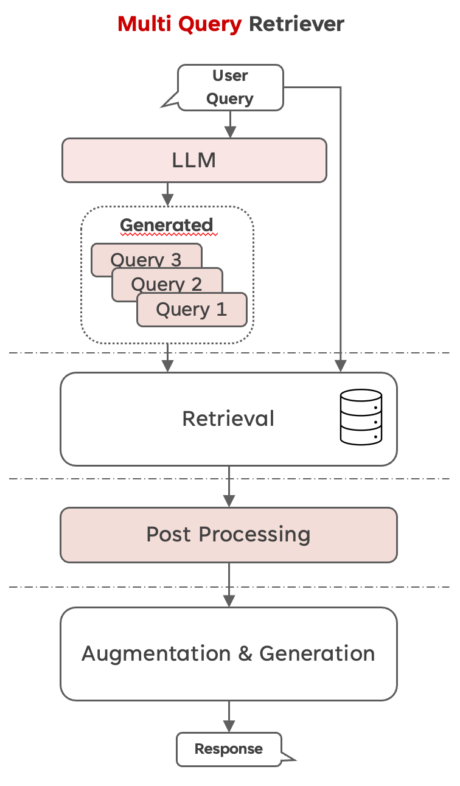

# Multi Query Retriever with PDF

This repo shows an example about Multi Query Retriever with PDF files about the
social support in Germany (Support for unemployment). You can find the pdf I used
in the folder [pdf file](./pdf_files) or at the homepage of the ["Agentur für Arbeit"](https://www.arbeitsagentur.de/).
 
I used the following components to build the Chatbot:

- Chainlit
- LangChain for LLM Orchestration
- OpenAI Embedding Model and LLM
- ChromaDB as the index database (Docker Container)

## What is a Multi Query Retriever (MQR)?

#### LangChain Explanation
Distance-based vector database retrieval embeds (represents) queries in high-dimensional space and finds similar embedded documents based on “distance”. But, retrieval may produce different results with subtle changes in query wording or if the embeddings do not capture the semantics of the data well. Prompt engineering / tuning is sometimes done to manually address these problems, but can be tedious.

The MultiQueryRetriever automates the process of prompt tuning by using an LLM to generate multiple queries from different perspectives for a given user input query. For each query, it retrieves a set of relevant documents and takes the unique union across all queries to get a larger set of potentially relevant documents. By generating multiple perspectives on the same question, the MultiQueryRetriever might be able to overcome some of the limitations of the distance-based retrieval and get a richer set of results.

So basically we are creating multiple questions from our original user query 
with the assumption, that we will get more relevant documents with rewriting queries.
Here is a simple image to show you the workflow:

For my purpose I changed the MQR class from LangChain slightly because I wanted
to get the generated queries after invoking the chain. So I changed the
get_relevant_documents methods to return a dictionary with the queries and
the documents. You can see the change [here](./src/pdf_chatbot/retriever.py).